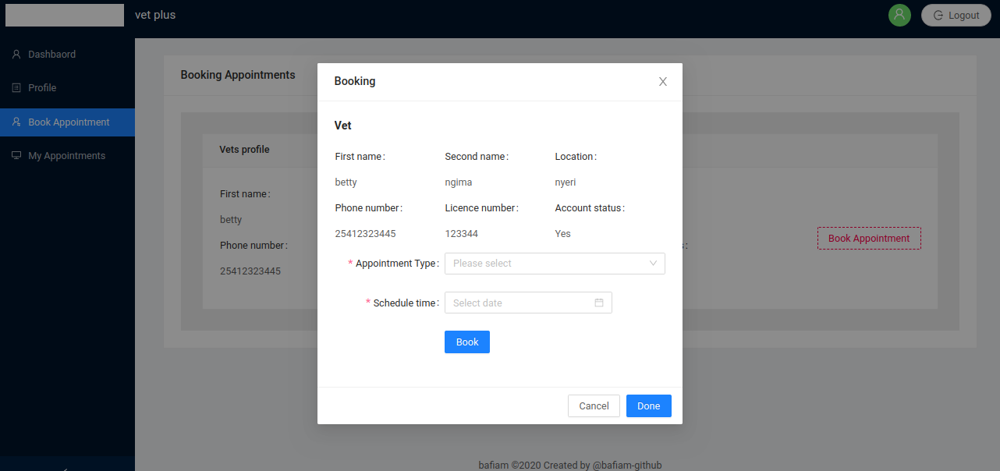
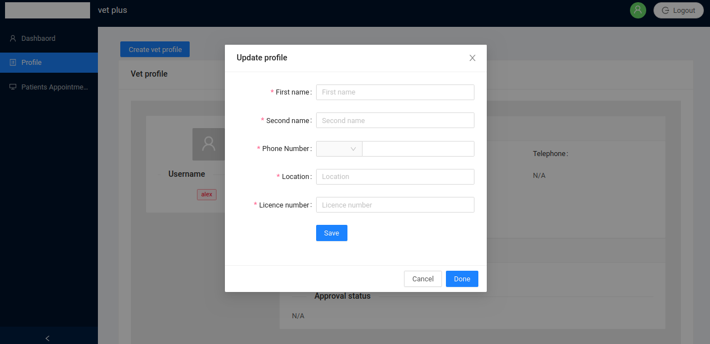
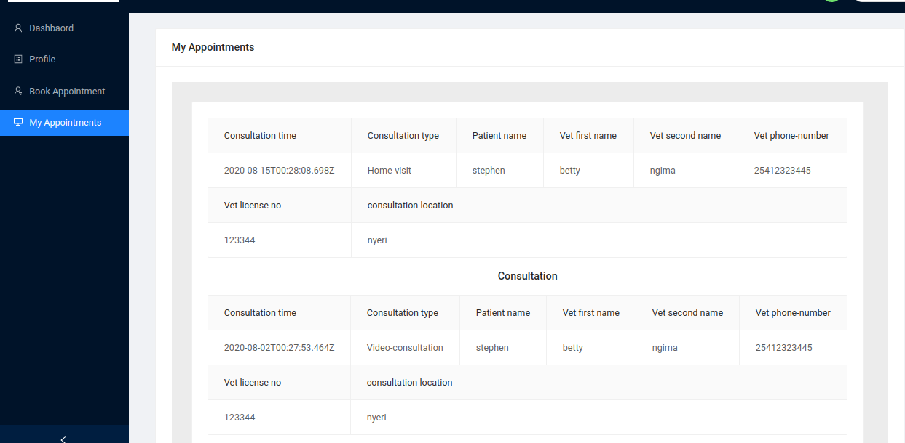
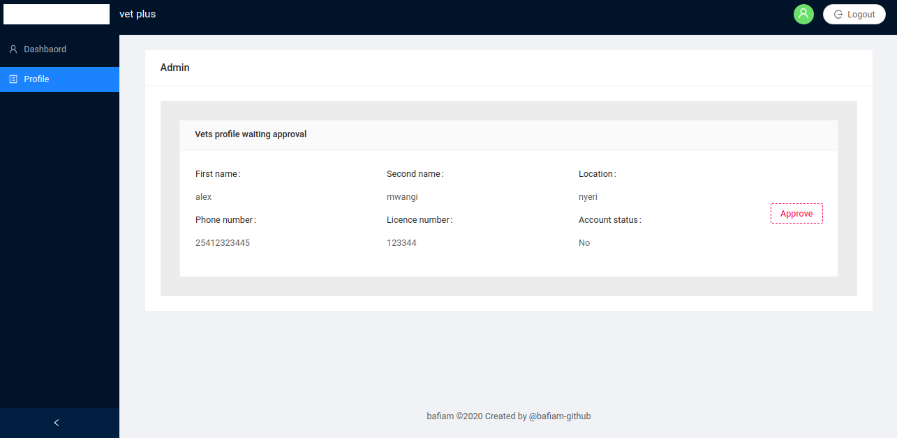

[![Contributor][contributor-shield]][contributor-url]
[![Issues][issues-shield]][issues-url]
<br />

<p align="center">
  <h1 align="center">Veterinary Clinic - Appointment Booking System Based on React and Redux </h1>
  <p align="center">
    React/Redux
    <br />
    <a href="https://github.com/bafiam/vetplus-frontend.git"><strong>Explore the docs »</strong></a>
    <br />
    <br />
    ·
    <a href="https://github.com/bafiam/vetplus-frontend/issues">Report Bug</a>
    ·
    <a href="https://github.com/bafiam/vetplus-frontend/issues">Request Feature</a>
  </p>
</p>

<!-- TABLE OF CONTENTS -->

## Table of Contents

- [About the Project](#about-the-project)
- [Screenshots](#screenshots)
- [Prerequisites Installations](#prerequisites-installations)
- [Technology used](#technology-used)
- [Usage/Getting Started](#how-to-Use)
- [Live Version](#live-version)
- [Roadmap](#roadmap)
- [License](#license)
- [Authors](#authors)

<!-- ABOUT THE PROJECT -->

## About The Project

This project is a Appointment Booking System built with React and Redux. It consumes an API and offer a user interaction interface that mimic a booking system allowing different user to access the API resources.

Feature summary :

- Interface Authentication.
- Vet approval interface for the admin.
- Profile interface for both patients and vets.
- View past and upcomming appointments by the patient.
- View booked appoitment request by the vet.
- Book an appoitment interface available only by patients.

Detailed project description can be found here [back end](https://github.com/bafiam/vetplus-backend). The system responsiveness in different screen start from 567 px going up.

## Helpers

Login as admin:

- username: admin
- password: 123456789

Seeded vet

- username: betty
- password: 123456789

Seeded user

- username: bafiamm
- password: 123456789

## Screenshots

#### Book an appointment



#### Vet profile



#### Patient appointments



#### Admin account approval



## Prerequisites Installations

<p>If you want a copy of this project running on your machine you have to install:</p>

- <a href="https://nodejs.org/en/">Node.js (v5. 2.0 or greater)</a>
- <a href="https://git-scm.com/downloads">Git version control system</a>

## Technology used

- Node.js
- React
- React-DOM
- React-Create-App
- Redux
- Antd
- npm
- CSS
- ES6
- React-thunk

## Usage/Getting Started

Once you have installed the required package shown on the [Prerequisites Installations](#required-installations), proceed with the following steps

Clone the Repository

```Shell
your@pc:~$ git clone https://github.com/bafiam/vetplus-frontend
```

Move into the cloned folder

```Shell
your@pc:~$ cd vetplus-frontend
```

Get the dependencies needed for the app

```Shell
your@pc:~$ yarn install
```

Run the test

```Shell
your@pc:~$ yarn test
```

Start the server and use the app

```Shell
your@pc:~$ yarn start
```

The system is connected to the [online backend version](https://github.com/bafiam/vetplus-backend). To run it locally and use a local version of the backend with a local version of the front end, you need to do some changes to the modules folder, action.js file.

```
- Replace
export const BASE_URL = 'https://mighty-badlands-24775.herokuapp.com';
- with
 export const BASE_URL = 'http://localhost:3000';
```

## Live Version

This is the link to the live preview. Feel free to visit.<br>
[Vetplus](https://trusting-tereshkova-822a5f.netlify.app/)<br>

<!-- ROADMAP -->

## Roadmap

See the [open issues](https://github.com/bafiam/vetplus-frontend/issues) for a list of proposed features (and known issues).

<!-- CONTACT -->

## Authors

Stephen Gumba

- [GitHub profile](https://github.com/bafiam)

<!-- MARKDOWN LINKS & IMAGES -->
<!-- https://www.markdownguide.org/basic-syntax/#reference-style-links -->

[contributor-shield]: https://img.shields.io/badge/Contributors-1-%2300ff00
[contributor-url]: https://github.com/bafiam/vetplus-frontend/graphs/contributors
[issues-shield]: https://img.shields.io/badge/issues-0-%2300ff00
[issues-url]: https://github.com/bafiam/vetplus-frontend/issues/
